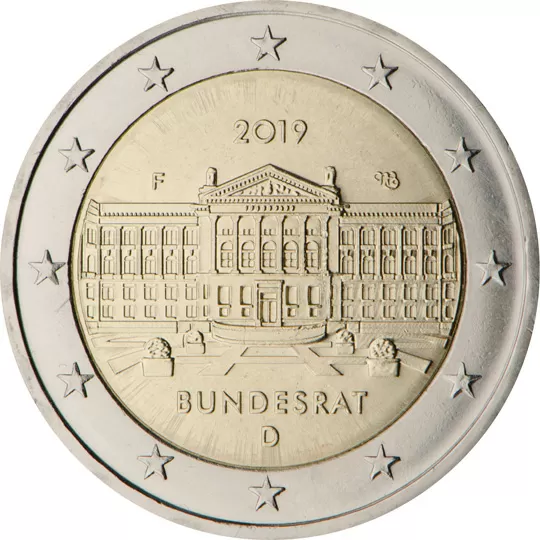

# Germany € 2.00

## Images

## Metadata

**Country:** [Germany](../../Countries/Germany/index.md)\
**Monetary value:** € 2.00\
**Currency:** Euro\
**Issue date:** 2019-01-29

## Description

The 70th anniversary of the Bundesrat’s founding

## Mintages

| Year | Mintmark | Circulated | Brilliant Uncirculated | Proof |
| ---- | -------- | ---------- | ---------------------- | ----- |
| 2019 | A        | 6000000    | 23900                  | 21000 |
| 2019 | D        | 6300000    | 19600                  | 16500 |
| 2019 | F        | 7200000    | 19600                  | 16500 |
| 2019 | G        | 4200000    | 19600                  | 16500 |
| 2019 | J        | 6300000    | 19600                  | 16500 |
