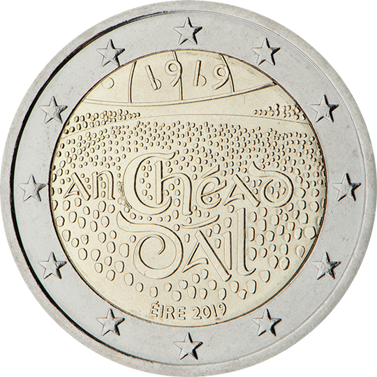

# Ireland € 2.00

## Images

## Metadata

**Country:** [Ireland](../../Countries/Ireland/index.md)\
**Monetary value:** € 2.00\
**Currency:** Euro\
**Issue date:** 2019-01-21

## Description

100 years since the establishment of the Dáil Éireann (Irish Parliament)

## Mintages

| Year | Mintmark | Circulated | Brilliant Uncirculated | Proof |
| ---- | -------- | ---------- | ---------------------- | ----- |
| 2019 |          | 1000000    | 8000                   | 1000  |
