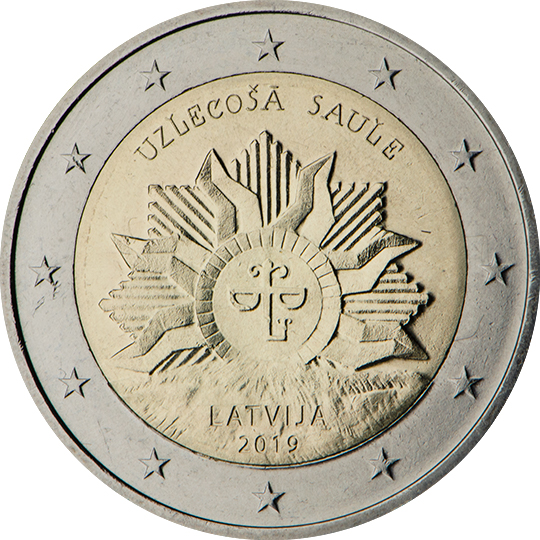

# Latvia € 2.00

## Images

## Metadata

**Country:** [Latvia](../../Countries/Latvia/index.md)\
**Monetary value:** € 2.00\
**Currency:** Euro\
**Issue date:** 2019-09-17

## Description

The rising sun

## Mintages

| Year | Mintmark | Circulated | Brilliant Uncirculated | Proof |
| ---- | -------- | ---------- | ---------------------- | ----- |
| 2019 |          | 300000     | 7000                   | 0     |
