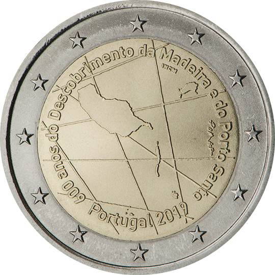

# Portugal € 2.00

## Images

## Metadata

**Country:** [Portugal](../../Countries/Portugal/index.md)\
**Monetary value:** € 2.00\
**Currency:** Euro\
**Issue date:** 2019-06-06

## Description

600 years of the discovery of the Madeira Archipelago, by the Portuguese navigators Bartolomeu Perestrelo and Tristão Vaz

## Mintages

| Year | Mintmark | Circulated | Brilliant Uncirculated | Proof |
| ---- | -------- | ---------- | ---------------------- | ----- |
| 2019 |          | 500000     | 10000                  | 10000 |
