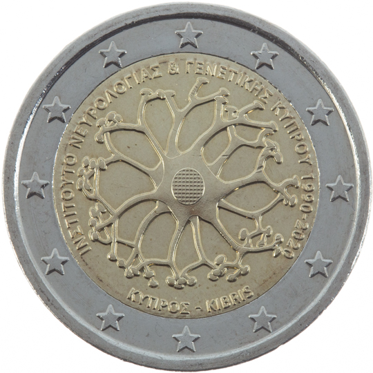

# Cyprus € 2.00

## Images

## Metadata

**Country:** [Cyprus](../../Countries/Cyprus/index.md)\
**Monetary value:** € 2.00\
**Currency:** Euro\
**Issue date:** 2020-12-14

## Description

The 30th anniversary of the Cyprus Institute of Neurology and genetics

## Mintages

| Year | Mintmark | Circulated | Brilliant Uncirculated | Proof |
| ---- | -------- | ---------- | ---------------------- | ----- |
| 2020 |          | 400000     | 6000                   | 12000 |
