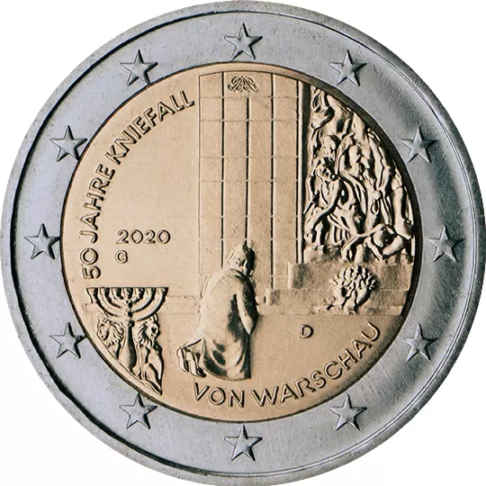

# Germany € 2.00

## Images

## Metadata

**Country:** [Germany](../../Countries/Germany/index.md)\
**Monetary value:** € 2.00\
**Currency:** Euro\
**Issue date:** 2020-10-08

## Description

The 50th anniversary of Willy Brandt’s Kniefall von Warschau

## Mintages

| Year | Mintmark | Circulated | Brilliant Uncirculated | Proof |
| ---- | -------- | ---------- | ---------------------- | ----- |
| 2020 | A        | 6000000    | 30000                  | 40000 |
| 2020 | D        | 6300000    | 30000                  | 40000 |
| 2020 | F        | 7200000    | 30000                  | 40000 |
| 2020 | G        | 4200000    | 30000                  | 40000 |
| 2020 | J        | 6300000    | 30000                  | 40000 |
