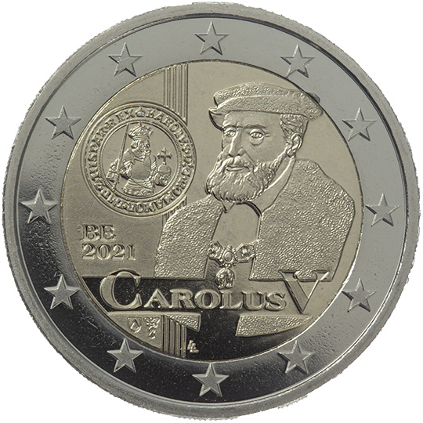

# Belgium € 2.00

## Images

## Metadata

**Country:** [Belgium](../../Countries/Belgium/index.md)\
**Monetary value:** € 2.00\
**Currency:** Euro\
**Issue date:** 2021-10-27

## Description
The 500th anniversary of the appearance of the ordinance of the second period of coin issuance during the reign of Charles V

## Mintages

| Year | Mintmark | Circulated | Brilliant Uncirculated | Proof |
| ---- | -------- | ---------- | ---------------------- | ----- |
| 2021 |          | 0          | 150000                 | 5000  |
