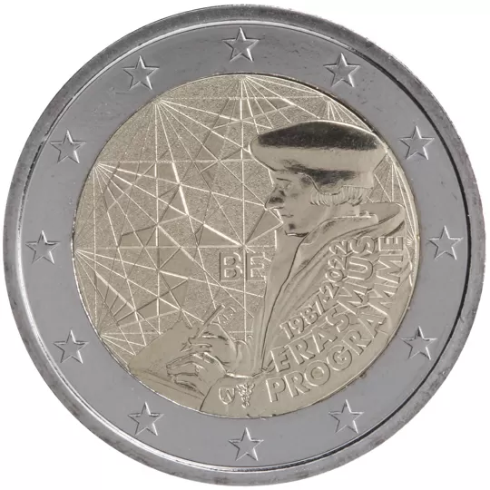

# Belgium € 2.00

## Images

## Metadata

**Country:** [Belgium](../../Countries/Belgium/index.md)\
**Serie:** [35th anniversary of the Erasmus program](index.md)\
**Monetary value:** € 2.00\
**Currency:** Euro\
**Issue date:** 2022-07-01

## Description

35th anniversary of the Erasmus program

## Mintages

| Year | Mintmark | Circulated | Brilliant Uncirculated | Proof |
| ---- | -------- | ---------- | ---------------------- | ----- |
| 2022 |          | 0          | 100000                 | 5000  |
