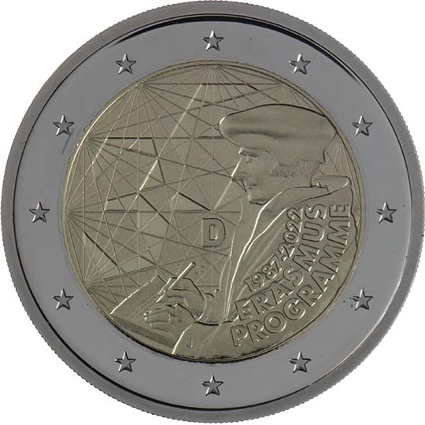

# Germany € 2.00

## Images

## Metadata

**Country:** [Germany](../../Countries/Germany/index.md)\
**Serie:** [35th anniversary of the Erasmus program](index.md)\
**Monetary value:** € 2.00\
**Currency:** Euro\
**Issue date:** 2022-07-01

## Description

35th anniversary of the Erasmus program

## Mintages

| Year | Mintmark | Circulated | Brilliant Uncirculated | Proof |
| ---- | -------- | ---------- | ---------------------- | ----- |
| 2022 | A        | 4000000    | 0                      | 0     |
| 2022 | D        | 4000000    | 0                      | 0     |
| 2022 | F        | 4000000    | 0                      | 0     |
| 2022 | G        | 4000000    | 0                      | 0     |
| 2022 | J        | 4000000    | 0                      | 0     |
