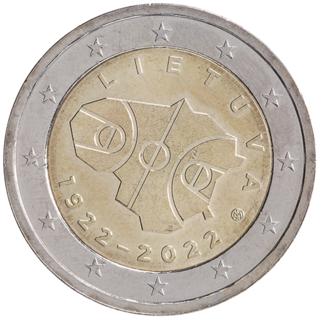

# Lithuania € 2.00

## Images

## Metadata

**Country:** [Lithuania](../../Countries/Lithuania/index.md)\
**Monetary value:** € 2.00\
**Currency:** Euro\
**Issue date:** 2022-04-21

## Description
100 years of basketball in Lithuania

## Mintages

| Year | Mintmark | Circulated | Brilliant Uncirculated | Proof |
| ---- | -------- | ---------- | ---------------------- | ----- |
| 2022 |          | 742500     | 7500                   | 0     |
