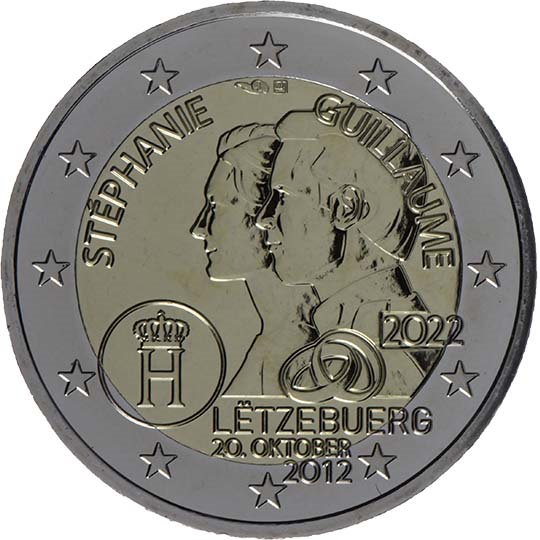

# Luxembourg € 2.00

## Images

## Metadata

**Country:** [Luxembourg](../../Countries/Luxembourg/index.md)\
**Monetary value:** € 2.00\
**Currency:** Euro\
**Issue date:** 2022-07-01

## Description
The 10th anniversary of the marriage of the Hereditary Grand Duke Guillaume and the Hereditary Grand Duchesse Stéphanie

## Mintages

| Year | Mintmark | Circulated | Brilliant Uncirculated | Proof |
| ---- | -------- | ---------- | ---------------------- | ----- |
| 2022 |          | 160000     | 7500                   | 0     |
