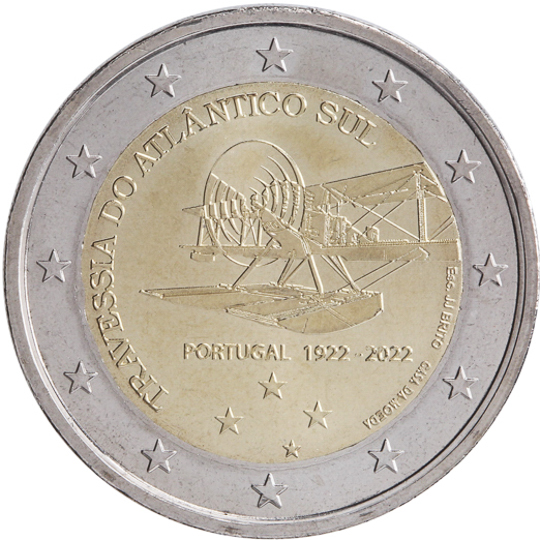

# Portugal € 2.00

## Images

## Metadata

**Country:** [Portugal](../../Countries/Portugal/index.md)\
**Monetary value:** € 2.00\
**Currency:** Euro\
**Issue date:** 2022-03-30

## Description

The 100th anniversary of the crossing the South Atlantic Ocean by air, achieved in 1922 by Gago Coutinho and Sacadura Cabral

## Mintages

| Year | Mintmark | Circulated | Brilliant Uncirculated | Proof |
| ---- | -------- | ---------- | ---------------------- | ----- |
| 2022 |          | 1000000    | 7500                   | 7500  |
