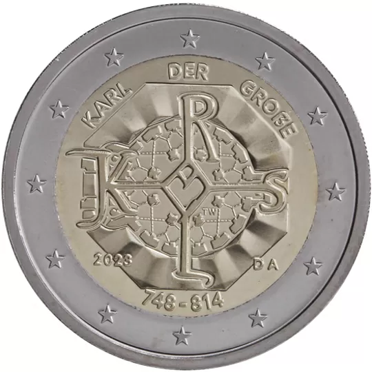

# Germany € 2.00

## Images

## Metadata

**Country:** [Germany](../../Countries/Germany/index.md)\
**Monetary value:** € 2.00\
**Currency:** Euro\
**Issue date:** 2023-03-30

## Description
The 1275th anniversary of the birth of Charlemagne (748–814), King of the Franks and Holy Roman Emperor

## Mintages

| Year | Mintmark | Circulated | Brilliant Uncirculated | Proof |
| ---- | -------- | ---------- | ---------------------- | ----- |
| 2023 | A        | 6000000    | 0                      | 0     |
| 2023 | D        | 6300000    | 0                      | 0     |
| 2023 | F        | 7200000    | 0                      | 0     |
| 2023 | G        | 4200000    | 0                      | 0     |
| 2023 | J        | 6300000    | 0                      | 0     |
