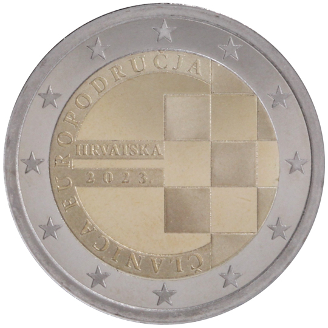

# Croatia € 2.00

## Images

## Metadata

**Country:** [Croatia](../../Countries/Croatia/index.md)\
**Monetary value:** € 2.00\
**Currency:** Euro\
**Issue date:** 2023-09-15

## Description
The introduction of the euro as the official currency of Croatia on 1 January 2023

## Mintages

| Year | Mintmark | Circulated | Brilliant Uncirculated | Proof |
| ---- | -------- | ---------- | ---------------------- | ----- |
| 2023 |          | 50000      | 200000                 | 0     |
