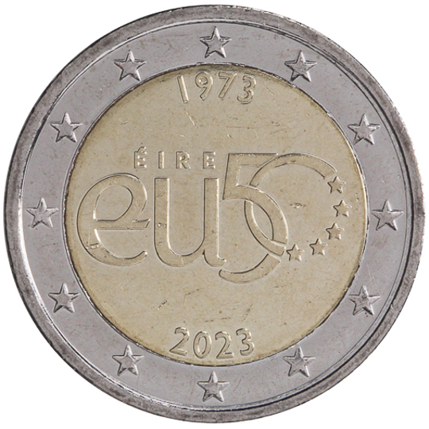

# Ireland € 2.00

## Images

## Metadata

**Country:** [Ireland](../../Countries/Ireland/index.md)\
**Monetary value:** € 2.00\
**Currency:** Euro\
**Issue date:** 2023-06-22

## Description
The 50th anniversary of Ireland’s membership of the European Union

## Mintages

| Year | Mintmark | Circulated | Brilliant Uncirculated | Proof |
| ---- | -------- | ---------- | ---------------------- | ----- |
| 2023 |          | 500000     | 0                      | 0     |
