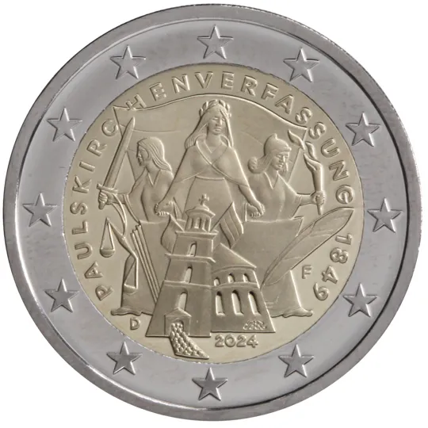

# Germany € 2.00

## Images

## Metadata

**Country:** [Germany](../../Countries/Germany/index.md)\
**Monetary value:** € 2.00\
**Currency:** Euro\
**Issue date:** 2024-03-21

## Description
The 175th anniversary of the Frankfurt Constitution (also known as the St Paul’s Church Constitution, which was the first attempt to create a unified German nation state.)

## Mintages

| Year | Mintmark | Circulated | Brilliant Uncirculated | Proof |
| ---- | -------- | ---------- | ---------------------- | ----- |
| 2024 | A        | 6000000    | 0                      | 0     |
| 2024 | D        | 6300000    | 0                      | 0     |
| 2024 | F        | 7200000    | 0                      | 0     |
| 2024 | G        | 4200000    | 0                      | 0     |
| 2024 | J        | 6300000    | 0                      | 0     |
