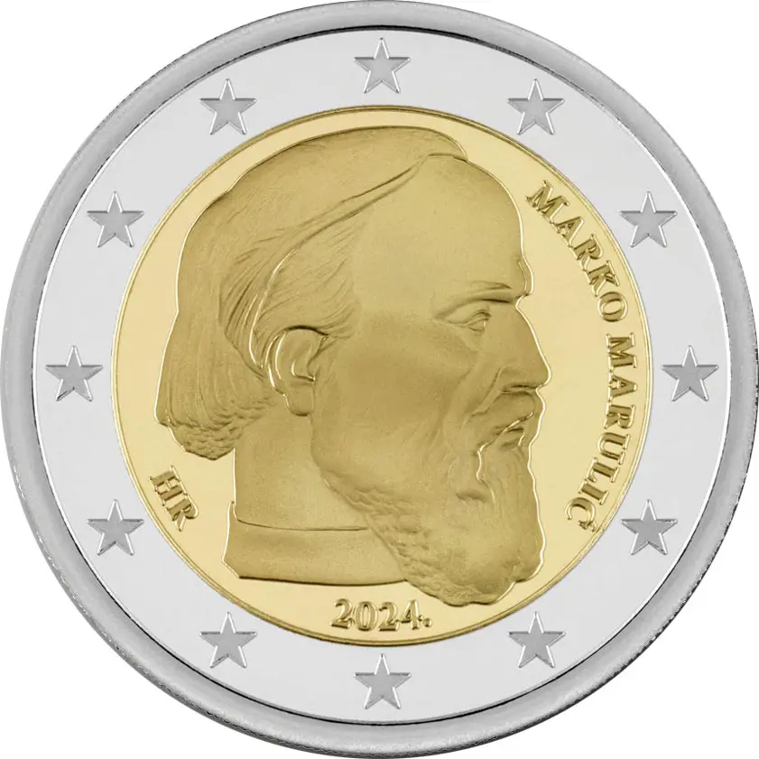

# Croatia € 2.00

## Images

## Metadata

**Country:** [Croatia](../../Countries/Croatia/index.md)\
**Monetary value:** € 2.00\
**Currency:** Euro\
**Issue date:** 2024-10-15

## Description
Marco Marulić

## Mintages

| Year | Mintmark | Circulated | Brilliant Uncirculated | Proof |
| ---- | -------- | ---------- | ---------------------- | ----- |
| 2024 |          | 0          | 0                      | 0     |
