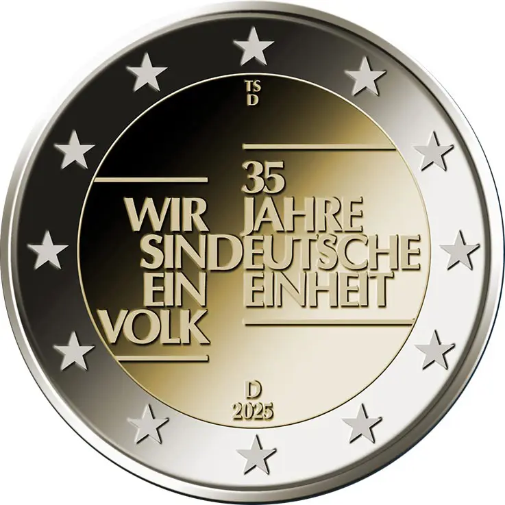

# Germany € 2.00

## Images

## Metadata

**Country:** [Germany](../../Countries/Germany/index.md)\
**Monetary value:** € 2.00\
**Currency:** Euro\
**Issue date:** 2025-09-25

## Description

35th anniversary of German Unity

## Mintages

| Year | Mintmark | Circulated | Brilliant Uncirculated | Proof |
| ---- | -------- | ---------- | ---------------------- | ----- |
| 2025 | A        | 0          | 0                      | 0     |
| 2025 | D        | 0          | 0                      | 0     |
| 2025 | F        | 0          | 0                      | 0     |
| 2025 | G        | 0          | 0                      | 0     |
| 2025 | J        | 0          | 0                      | 0     |
